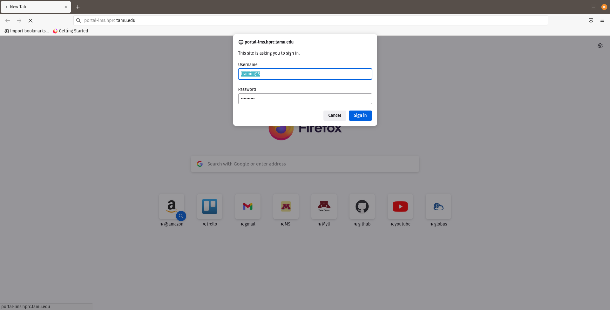
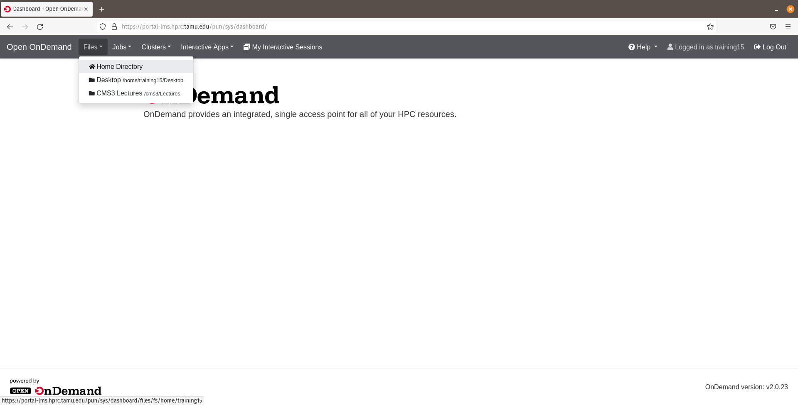
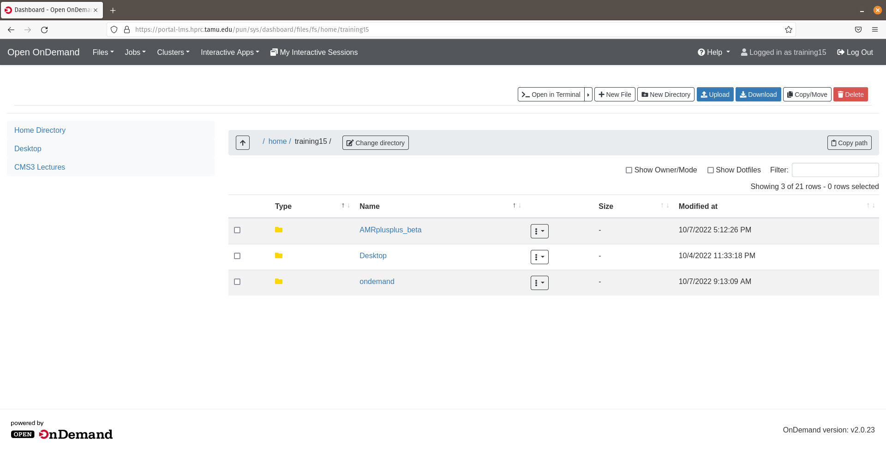
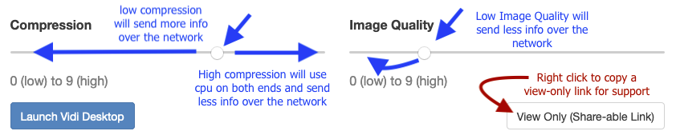
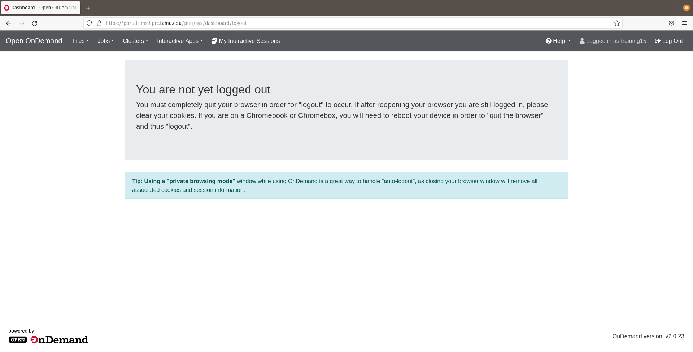
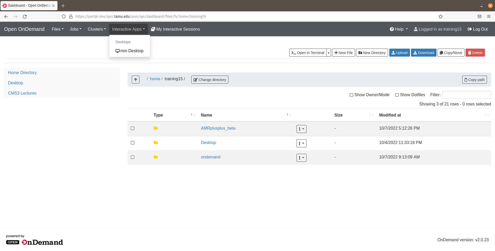
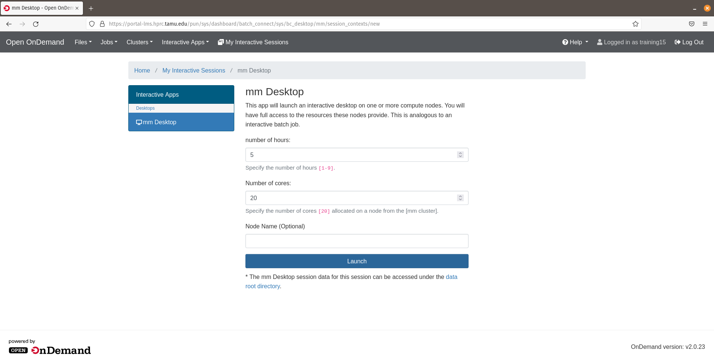
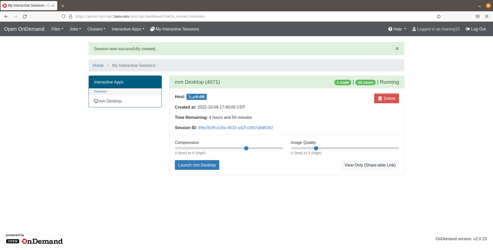
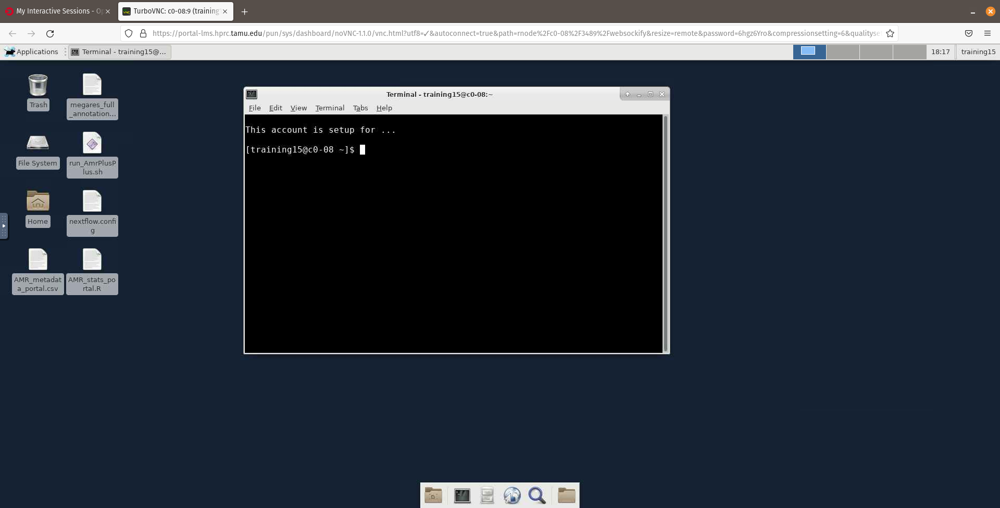
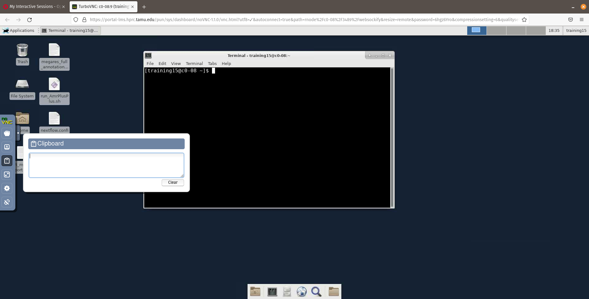

Server command line 
===================

## Training portal

To begin the hands-on portion of the workshop we will load up the TAMU training portal. Paste this web address into your web browser:

```bash

portal-lms.hprc.tamu.edu

```

As seen in the image below the dropdown box is where you will place your username and password.





Now that you are logged into your portal dashboard...Click on the `Files` dropdown tab and you will be redirected into your training `home` directory.





Here, you will experience a GUI file explorer, this is where we can use the feature to `Upload` or `Download` files to the portal. This will come in handy to download and explore the





If you are in need of support from our instructors, we will navigate to the `My Interactive Sessions` tab. Once on this page we will right click on the `View only (Share-able link)`.





This will pull up a new Interactive Desktop tab (as seen in the image below). You will then copy the URL from your web browser and paste this into the MEG Slack group or Zoom chat and an instructor now will be able to have a live view your Interactive Desktop and be able to help you troubleshoot any problems going on!


When you are ready to logout of the portal, click the `Log Out` tab (top right of your browser). Once loaded, you will then see a message on how to completely log out of the training portal.





Now onto the [Interactive Desktop](./tamu_cli_hands_on.md) and hands-on command-line portion.





You will now be able to choose the number of hours. Let's go with 12 and by default 20 cores to use for the workshop (Please, ignore the 5 hours in the screen shot 😅) . Click the `Launch` to start the queue to load the Interactive Desktop.





You will be queued for a brief moment and then once your session is created we will click the `Launch mm Desktop` button to launch a new web browser tab with your Interactive Desktop.





---


## Command-line basics

Now on your new Interacivte Desktop tab, click on the terminal emulator app and then we will begin the command-line portion of the workshop!




A helpful tip on the Interacive Desktop is using the clipboard feature to copy and paste text. 



Recall the basic structure of the command line:

```bash

$ command <option(s)> <argument(s)>

```

The first command we will run is `pwd`, this stands for "print working directory" and by default it will print out the `absolute path` of where you are currently standing on the file system. The `absolute path` begins at the root directory `/` and follows the path until the path to the desired directory or file is completed.

```bash

$ pwd

$ echo $USER

$ echo $PATH | less 

$ man less 

$ which pwd ls cd
$ type pwd ls cd 

$ module avail 
$ module list

```

To change directories we will use the `cd` command and we will give it the `relative path` to your `Desktop` directory. Here the relative path starts from your working directory (i.e. as if now your `home` directory). This is where you are currently standing on the file system. 

When it comes to the `relative path`  it is important to note there are a couple of special notations to represent relative positions in the file system. These special notations are `.` (dot) and `..` (dot dot). The `.` notation refers to the working directory and the `..` notation refers to the working directory's parent directory.

```bash

$ cd Desktop

```

Now in your `Desktop` directory we will us the `ls` command. By default it will list the contents of the directory where you are currently standing.

```bash

$ ls

```
As you can see there is nothing in our `Desktop` subdirectory. If there is no worries! We will create a subdirectory to do some file manipulation practice

```bash

$ mkdir practice 

$ cd practice

$ mkdir dir1 dir2

$ touch file1 file2.txt file3.md dir1/file4.fastq.gz dir2/.file5

```

Now lets list the contents of our `practice` directory

```bash

$ ls
$ ls dir1
$ ls dir2
$ ls -l .
$ ls -l 
$ ll
$ alias ll
$ ll -a dir2

```
Now we lets manipulate a file. Lets start by renaming the file using the `mv` command. Lets, then add a line of text to the file with the `echo` command and redirection `>`. To print the standard output of what inside of the file to terminal lets use the `cat` command. 

```bash

$ mv file1 file1.sh

$ echo "The command-line is kinda fun...maybe" 
$ echo "The command-line is kinda fun...maybe" > file1.sh

$ cat file1.sh

$ less file1.sh 

```

Lets now copy a file from another location with the same name. This is important to see, because this will overwrite our file we were just working on. When using commands such as `cp`(copy) `mv`(move) and `rm`(remove) be aware of the potential to unintentially overwrite or remove files. The command-line assumes we are aware of the consequence 😏

```bash

$ cp /home/training15/file1.sh .

$ head file1.sh

```

Now lets run this `bash` script. First we will need to change some file permissions. Lets see the output!

```bash

$ chmod u+x file1.sh

$ ./file1.sh   # Or bash file1.sh

$ chmod g+x,o-r file2.txt

```
Next less look at a basic wildcard special character with the help of our friend `ls` and a new friend `find`

```bash

$ ls *

$ ls file*

$ ls *.md

$ find . -name "*.fastq.gz"  

```

Now lets look clean up our practice by removing some files with some !

```bash

$ rm file1
$ rm file*
$ find . -name "*.fastq.gz" -delete

```
Now we can recursively remove our practice area.

> Note it is always a good idea to do some practice with our file manipulation commands, so we can understand how they work before we use them on our data. ☺️

```bash
$ cd ..
$ rm -rf practice


```
Finally, lets return to our `~` directory. There are few different ways we can this...

```bash

# Relatively where you are currently standing
$ cd ../..

# Quick shortcuts to go back home!
$ cd ~
$ cd

```

Lets now create a simple structure for our bioinformatic workflows and see what it looks like!

```bash

$ mkdir -p workshop/{data,docs,scripts}

$ tree workshop

```

Now lets relatively navigate into the `workshop` directory. This will be the our working directory for the bioinformatic analyes!

```bash

$ cd workshop 


```


